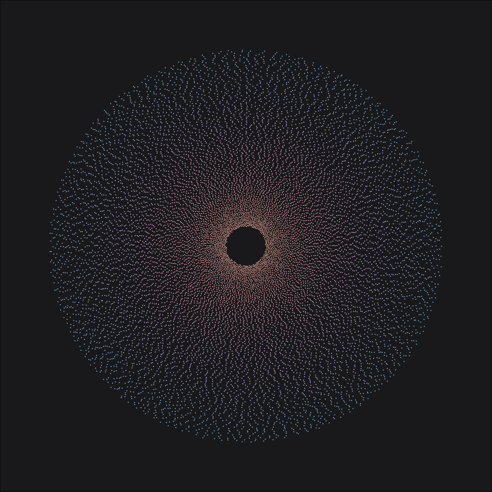
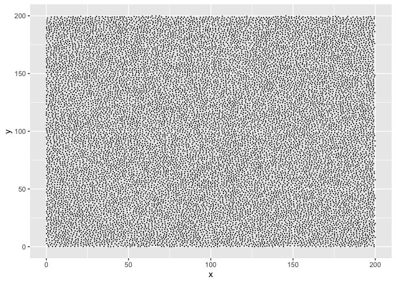
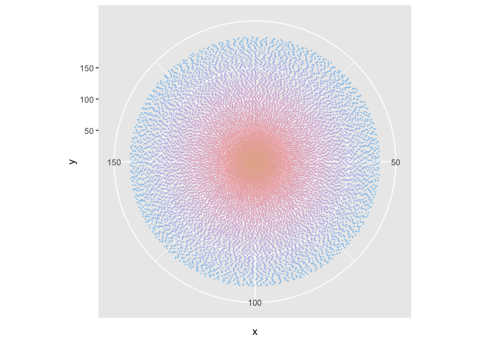
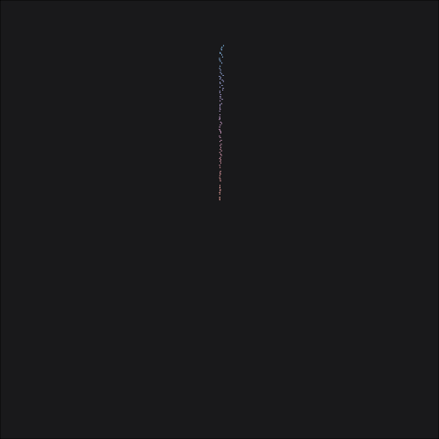

circles
================

 

Image shows 14,438 points. Points were simulated using a Poisson
distribution
([`poisson_disc()`](https://github.com/will-r-chase/poissondisc)) and
made to look like they were placed ‘randomly’ on the `X` and `Y` axis.
Each point is a minimum distance from any other point:

 

We can wrap the `X` and `Y` axis into a circle using `coord_polar()` and
then give each point a colour based on its `Y` axis position. `Ymin` is
the centre of the circle; `Ymax` is the outer most point of the circle;
`Xmin` and `Xmax` are at the top of the circle with the axis running
clockwise:

 

The data is simulated with a starting point (`X` = 0, `Y` = 0). Each
subsequent point is simulated relative to the preceding points position,
if the next point is simulated too close to a previous point, the
previous point is removed from the data. As a result the points are
simulated in an order but that order does not correspond directly to an
increase in the `X` or `Y` position of the point. This means that there
is ‘randomness’ in the order the point is simulated and the position on
the `X` and `Y` axis. We can use this to produce a nice animation that
traverses the `X` axis and looks like a radar:

 

Or if we make the animation traverse the `Y` axis it looks like a pulse:

