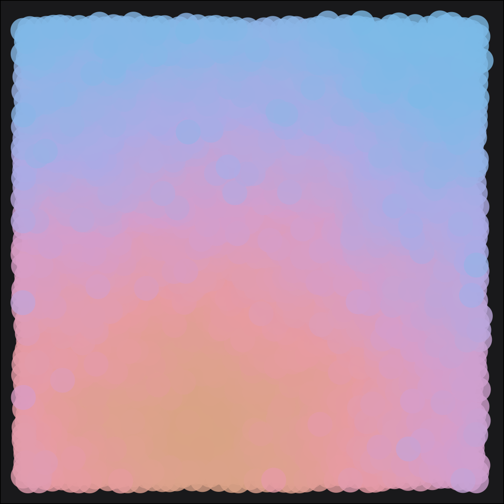
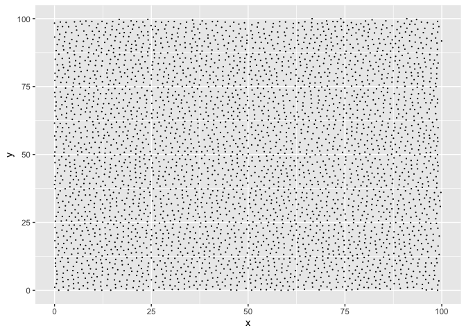
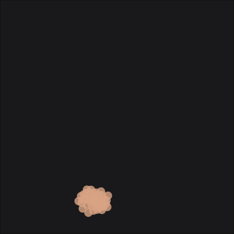

circles
================

 

Image shows 3,530 points. Points were simulated using a Poisson
distribution
([`poisson_disc()`](https://github.com/will-r-chase/poissondisc)) and
made to look like they were placed ‘randomly’ on the `X` and `Y` axis.
Each point is a minimum distance from any other point:

 

The data is simulated with a starting point (`X` = 40, `Y` = 10). Each
subsequent point is simulated relative to the preceding points position,
if the next point is simulated too close to a previous point, the
previous point is removed from the data. As a result the points are
simulated in an order but that order does not correspond directly to an
increase in the `X` or `Y` position of the point. This means that there
is ‘randomness’ in the order the point is simulated and the position on
the `X` and `Y` axis. We can colour points based on their simulated
order, which loosely corresponds to their position on the `Y` axis and
results in a gradient colouring. We can illustrate this nicely in an
animation:

